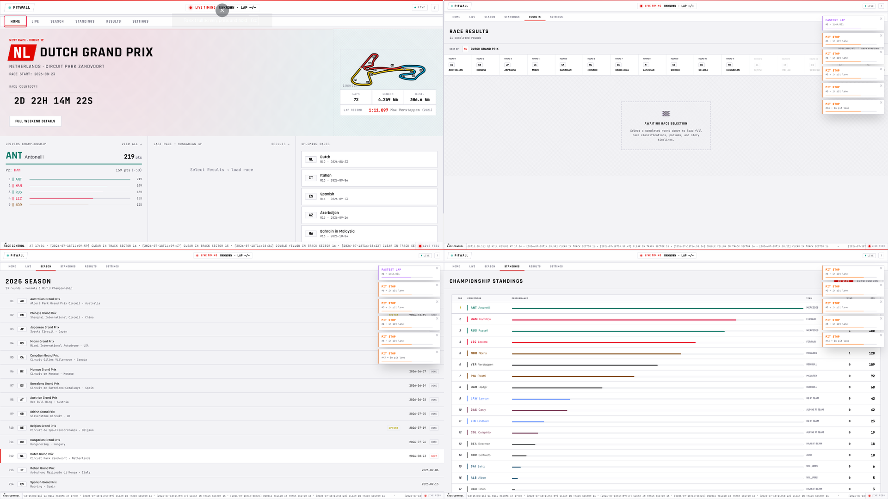

<div align="center">

# 🏎️ PITWALL — Real-Time F1 Timing & Telemetry Dashboard
### High-performance Formula 1 session timing, interactive telemetry, and live track maps

<!-- BADGE ROW 1 — Context & Status -->
[](#)
[](#)
[](#)
[](#)

<!-- BADGE ROW 2 — Actual Tech Stack -->


> **Context line:** Personal Engineering Project &nbsp;|&nbsp; **Category:** Real-Time Data Visualization & Analytics &nbsp;|&nbsp; **Data Sources:** OpenF1 API & Jolpica/Ergast API

🔴 **Demo:** Coming soon — will be replaced with 🔗 **[Live Demo](https://pitwall-frontend.vercel.app)** once hosted

</div>

---

## 📸 Preview



## 🧠 Overview

PITWALL is an engineer-grade Formula 1 timing and telemetry dashboard designed to deliver live Grand Prix timing, speed/RPM telemetry comparisons, and interactive circuit map visualizations completely free of cost. It bridges real-time telemetry streaming with historical session analysis to give fans and engineers a professional pitwall experience.

## ✨ Key Features

- **Live Session Timing & Driver Gaps** — Sector time indicators (purple/green/yellow), interval gaps, tire compound tracking, and pit status in real time.
- **Dynamic Track Canvas Rendering** — Interactive HTML5 canvas track layouts driven by open-source GeoJSON circuit data with active sector highlighting.
- **Multi-Driver Telemetry Charts** — Synchronized speed, throttle, brake, gear, and RPM comparison curves powered by Recharts.
- **Virtualized High-Frequency Lists** — Smooth table rendering for hundreds of driver lap iterations using `react-window` to eliminate DOM lag.

## 🏗️ Architecture

```
[ OpenF1 / Jolpica APIs ] ──▶ [ FastAPI Backend + SignalR Sync ] ──▶ [ Async SQLite Cache ]
                                              │
                                     (WebSocket Feeds)
                                              ▼
[ Recharts & Canvas Map ] ◀── [ Zustand Global Store ] ◀── [ React 18 UI + Framer Motion ]
```

A dual-ingestion architecture decouples external API latency from client rendering. The FastAPI backend aggregates asynchronous telemetry queues into a local SQLite cache while broadcasting live deltas via WebSockets directly into Zustand transient state.

## 🔥 The Hard Part

**Problem:** Ingesting high-frequency telemetry feeds across 20+ drivers concurrently caused severe React component re-render cascades and browser frame drops during live sessions.  
**Approach:** Attempted traditional React state propagation and polling intervals, which locked the UI thread during multi-lap chart updates.  
**Solution:** Migrated global session state to Zustand with selective sub-tree subscriptions, decoupled canvas map updates from React DOM cycles, and implemented `react-window` virtualization for driver timing tables.

## 📁 Project Structure

```
Project F1/
├── pitwall/
│   ├── backend/
│   │   ├── main.py          # FastAPI endpoints & WebSocket broadcaster
│   │   ├── db.py            # Async SQLite cache layer
│   │   ├── scheduler.py     # Session state & calendar sync background jobs
│   │   └── signalr_client.py# OpenF1 live telemetry stream consumer
│   └── frontend/
│       ├── public/          # Circuit GeoJSON maps & assets
│       └── src/
│           ├── components/  # Timing tables, track canvas, telemetry charts
│           ├── hooks/       # Custom telemetry & WebSocket hooks
│           ├── pages/       # Live, Results, Standings, & Season views
│           └── store/       # Zustand high-performance session store
└── README.md
```

## 🚀 Run It Locally

```bash
# 1. Clone the repository
git clone https://github.com/msuryawanshi05/Project-f1.git
cd Project-f1

# 2. Run the Backend (Python FastAPI)
cd pitwall/backend
python -m venv venv
# Windows: venv\Scripts\activate | Unix: source venv/bin/activate
pip install -r requirements.txt
uvicorn main:app --reload --port 8000

# 3. Run the Frontend (React + Vite)
cd ../frontend
npm install
npm run dev
```

### Config / Environment Variables

The backend works out-of-the-box using free public APIs (OpenF1 & Ergast/Jolpica). An optional `.env` file can be placed in `pitwall/backend/` for server configuration:

```env
HOST=127.0.0.1
PORT=8000
CORS_ORIGINS=http://localhost:5173
```

## 📈 What's Next

- [ ] Alignment with 2026 FIA Technical Regulations & telemetry telemetry channels
- [ ] Multi-driver side-by-side video sync overlay
- [ ] Automated race strategy pit window probability calculator

---

<div align="center">

Built by **msuryawanshi.05**

</div>
